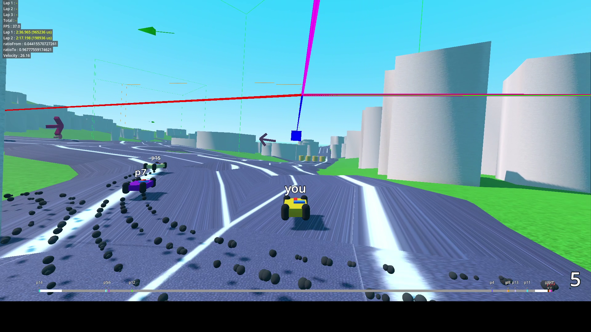

# Open Street Kart

An arcade kart game where you race in real life areas reconstructed from Open Street Map



# Credits

## Project

### Software

```
Open Street Kart is an arcade kart game where you race in real life areas reconstructed from Open Street Map
Copyright (c) 2025 Charly Schmidt aka Picorims<picorims.contact@gmail.com> and Open Street Kart contributors

This Source Code Form is subject to the terms of the Mozilla Public
License, v. 2.0. If a copy of the MPL was not distributed with this
file, You can obtain one at https://mozilla.org/MPL/2.0/.
```

### Artistic assets (excluding third party assets like Road Generator add-on assets)

<a href="https://github.com/Picorims/open-street-kart">Open Street Kart textures, materials, music, sound, and other artistic assets</a> © 2025 by <a href="https://github.com/Picorims/open-street-kart">Picorims and Open Street Kart contributors (see notice on individual assets for the exact authors)</a> is licensed under <a href="https://creativecommons.org/licenses/by-sa/4.0/">Creative Commons Attribution-ShareAlike 4.0 International</a>

#### Milky Way

<a href="https://www.eso.org/public/images/eso0932a/">The Milky Way panorama</a> by ESO/S. Brunier, licensed under <a href="https://creativecommons.org/licenses/by/4.0/">CC BY 4.0</a> and used in original and modified forms.

## Data

### Elevation

Elevation is generated from the ASTER dataset (ASTGTMV003) (https://terra.nasa.gov/data/aster-data).
The source used is Earthdata Nasa service: https://www.earthdata.nasa.gov/data/catalog/lpcloud-astgtm-003#toc-citation

NASA/METI/AIST/Japan Spacesystems and U.S./Japan ASTER Science Team. (2019). <i>ASTER Global Digital Elevation Model V003</i> [Data set]. NASA Land Processes Distributed Active Archive Center. https://doi.org/10.5067/ASTER/ASTGTM.003 Date Accessed: 2025-07-04

### Geographical data, roads, etc.

All other data is built from the OpenStreetMap database, fetched using the Overpass API.

OpenStreetMap data is made available under the ODbL license, and copyright belongs to OSM contributors.
For more information, see: https://www.openstreetmap.org/copyright

## Addons

Addons are used in this project. For more information, have a look at the `addons` directory, where each add-on specify their license.

- Debug Draw 3D: MIT License
- Road Generator: MIT License
- Sky3D: MIT License