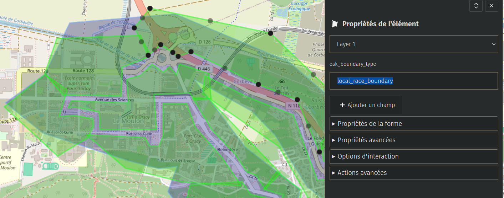

# How to create an Open Street Kart track

## Drafting a track

The first step is to draft a potential race track. The easiest way to do this is to create a GPX trace. You may for example use [gpx studio](https://gpx.studio/app#0/0/0). For example, by picking the bike mode (optionally disabling routing in the pencil icon tab, if at some point it doesn't go as you wish). The reference here, in the calendar icon tab, is ideally less than 5:00 at 100km/h (which is roughly 25m/s, i.e the challenging speed mode).

In terms of game design, you can follow these tips:
- Have a minimum of turns and curves. The more straight lines (and long ones), the more boring the track may be. You can counter that by envisioning traffic (cars, buses, trains, etc. on specific roads).
- Keep in mind that harsh turns and narrow paths automatically make the track hard! If you are aiming for an easy track, try sticking to wide paths, and reasonable large curves.

## Gathering data

To build your track and import it in Open Street Kart, you need some preliminary data exported in specific ways.

### Open Street Map data

Head over to https://overpass-turbo.eu/ and use a query as following, adjusting the latitude and longitude (keep a copy of your query!):

```overpassql
[out:json];
(
  nwr(48.66976838437996,2.1481704711914067,48.71702031217027,2.196750640869141);
);
out;
```

Try keeping the selection as small as possible, just enough to have a surrounding environment. Processing data is costly both for this service and for importation by Open Street Kart! The example above is the bounding box for importing the Orsay track data, for reference.

Export the query result as `json` and `geojson`. `json` is the original format, while `geojson` is a conversion done by Overpass, which is the format used by Open Street Kart (the main advantage is that polygons and paths points are already grouped).

### Elevation data

Elevation data is fetched from an intermediate API tool run locally, which read from a raw elevation dataset.

Head over to https://www.opentopodata.org/.  Follow the docker instructions (https://www.opentopodata.org/server/) to run the API. Install the ASTER dataset (ASTGTMV003) (https://www.opentopodata.org/datasets/aster/). If you do not want to download the whole dataset (It can be tricky to do, and uses a lot of disk space), pick a few selected files in the URLs file covering the degrees you need.

You can use the Python script over at https://github.com/Picorims/osk-elevation-fetcher to create a CSV file with elevation data within the specified bounding box (use the same one as for elevation data). This was tested with Python 3.12 as of September 2025.

### Custom data

Some data used for building the track is data driven, such as boundaries. To create them, you can use https://umap.openstreetmap.fr/fr/. The idea is to create polygons representing areas.

Draw one polygon with the field `osk_boundary_type` set to `race`. This is the full detail area which will be imported. Keep it as minimal as possible, as the procedural generation is costly, and many items can cause bad performance. Going outside this boundary re-spawns the player

Then, create multiples polygons with the same property set to `local_race_boundary`. Those areas define the race boundaries in a more detailed way. Entering into them re-spawns the player. They are useful to avoid players being lost, and to prevent unwanted shortcuts.



### Importing into Godot

Create a directory in `maps`, named after your track in `snake_case`. Add in the elevation `tsv` file, the `overpassql` query file (text file with the query), and the `geojson` files from Open Street Map and uMap. An example of nomenclature can be found in the `orsay` directory.

## Creating the track

- Go to `main.gd` and add your track to the `Track` enum.
- Under `scenes/races`, create a new scene named after your track (keep it consistent with the name in `maps`).

### Setting up the scene

- Pick a 3DNode as the root, and name it after your track name.
- Add a script file having the exact same name as the scene, saved in the same directory, to your root node. Its content is the project notice followed by this block (indentation fix needed):

```gdscript
class_name TrackOrsay extends Track

func apply_osm_mutations_action(root: Node3D, generator: OSMDataGenerator):
    pass
```

Replace `Orsay` with your track name. Methods are explained in the `Track` class.

The `Track` class is there mainly as a linter and for assertion, ensuring the scene matches the standardized scene structure and naming convention. It can also apply mutations to generated data upon the loader request.

#### World Environment

Use Orsay environment as a basis, then tweak it. Keep performance in mind when editing it.

#### PlayerSpawner (scene instance)

Defines where the karts are spawned. It must be placed so that all karts are already along the `RacePath`. It needs a reference to the `RacePath`. Cars snap to the ground automatically.

#### MapDataLoader (scene instance)

Loads all the data driven content. It needs to be properly configured for the map to generate correctly:
- Topo Data Path: path to the `.tsv` file with elevation data (`res://...`).
- Osm Data Path: path to OSM `.geojson` file.
- Boundaries Data Path: path to uMap `.geojson` file.
- Latitude / Longitude Origin: coordinates of the South-West bounding box corner, which is also the first line of the `.tsv` file (first value is longitude, second is latitude). It also corresponds to the corner with the lowest coordinates on both axes.
- Elevation Origin: Elevation in meters represented by Y=0.

To generate content, run tasks in this order:
- Reload Surface
- Reload Boundaries Data
- Reload OSM Data (can take a while and freeze the editor)

#### %ProceduralDataHolder (basic node 3D)

Host of data generated by MapDataLoader. Avoid editing it by all means, as it is always overridden by tool scripts. It must be global (`%`).

#### Checkpoints (node types)

Contains all the game checkpoints. Place loop checkpoints in a `LoopCheckpoints` child, and track checkpoints in `TrackCheckpoints`, preferably in order.

You can adjust the box size, spawn point position and angle. Place the spawn point a bit above the ground. Make sure the checkpoint is as hard to skip as possible, to be sure the player crosses it and won't re-spawn to the previous one (making it even more frustrating and punishing). Exceptions can be shortcuts skipping a checkpoint (increases the risk), or unintended behavior (non intended shortcuts that are overkill, out of bounds, etc.).

It also contains the `RacePath` which is used for AI and ranking. It is made of `RacePathNode` children which describe the path. Their radius define the road size, and their position and angle define the path trajectory (smoothed between nodes). It needs a ref to its successor and predecessor, if they exist. To make it a bit easier, click on "Bind to previous child" to configure this, from the last to the second node. (Could be automated?).

The path must start before the player spawner and finish after the track ending delimitation. An inaccurate path (clipping in ground or being way above, not well centered across the whole track, incorrect and especially too wide ranges, etc.) will lead to much struggle for the bots. Good practice includes placing a checkpoint before and after a turn, in the middle of an S, and when the altitude changes (local extremum).

#### %TrackState (node type)

Stores all the game state. Needs a reference to all loop checkpoints in order, as well as a reference for the `PlayerSpawner`. It must have the `track_state` group.

#### Jumps (basic node 3D)

Group for all jumps related nodes.

#### Walls (basic node 3D)

Group for all wall related nodes. Includes `WallOfWheels` instances, which are configured through the path curve. Reloads by itself (might need a scene reload).

#### Arrows (basic node 3D)

Group for all navigation related nodes.

#### Troubleshooting

In case of assert failures, make sure that all node references are defined correctly as explained above, and that the data loader is configured correctly.

### Adjustment

If everything is working as expected, the rest of the work is iterating to fix various issues and improve the track. You can override the data files at any time and press the loader buttons again to refresh procedural data (existing nodes in the `ProceduralDataHolder` will be lost). Your track should appear in the GUI to be picked.